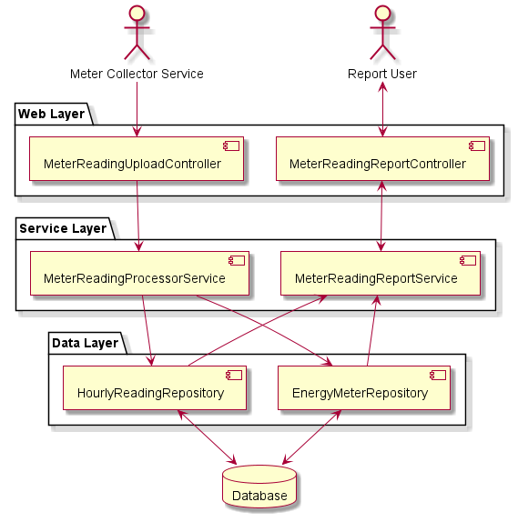

# Requirements
* Reports containing following information shall be made available based on uploaded XML files in examples:
  * Per meter hourly energy
  * Per meter hourly price
  * Per meter total energy
  * Per meter total price
* If format of the XML file is not valid, upload shall be rejected.
* Intervals belonging to same hour shall be merged.
* If intervals belonging the same hour does not cover the whole hour, upload shall be rejected.
* If intervals within same file has overlapping entries, upload shall be rejected.
* If any interval bigger than one hour exists, upload shall be rejected.
* Price for hour shall be calculated based on price in the corresponding reading file.
* If reading for an hour already exists, new entry shall be used to update existing entry.
* If interval duration is more than one hour, upload shall be rejected.
# Design
## Assumptions/Design Decisions
* It is assumed that there will be a queue in between the actual report streams and application to scale the service.
* It is assumed that service feeding XML to application will retain data for replay/troubleshoot/audit purposes.
  * Due to this assumption, data is not stored at full granularity but only at granularity level reporting needs (1 hour).
* Since price can be different across readings, readings need to be linked with price, however price data will be denormalized and price per hourly reading will be kept.
  * To prevent any performance issues (avoiding joins)
  * To make reporting easier.
* Meter list and reading list is not linked, meaning integrity is not enforced at DB level.
  * Integrity is enforced by transactional update.
## Improvement points
* Unit of price may be stored and handled.
* BigDecimal is used to prevent precision issues for floating values. Still this decision may be revisited to come up with a final decision.
* Endpoints do not follow REST convention fully.
## Static View

### Web layer
  * MeterReadingUploadController: Responsible to serve meter reading XML uploads
  * MeterReadingReportController: Responsible to serve meter reporting requests
### Service layer
  * MeterReadingProcessorService : Parses/Aggregates reading and persists data using data access layer
    * Parses and validates content of XML
    * Aggregates entries per hour and adds price (denormalize)
    * Insert new entries or update existing entries if same entries already present in DB 
   * MeterReadingReportService : Creates reports using data access layer
     * Uses aggregate queries
### Data access layer
  * EnergyMeterRepository: Handles meter related data access
  * HourlyReadingRepository: Handler hourly reading related access
#### Model
  * EnergyMeter : Entity corresponding to a meter
    * Id
    * Title
  * HourlyReading : Hourly readings by meters
    * Composite id
      * MeterId
      * HourStartEpoch
    * ReadingAsWh
    * PricePerKwh
# Implementation
* Programming language: Java (Java 17)
* Framework: Spring-boot (Spring Web, Spring Data JPA)
* Supporting libraries: Lombok, MapStruct, ThreeTen (Interval class)
* Build tool: Maven
* Other tools: Jacoco
# Testing
* Unit tests
  * JUnit 5 based
  * Only for business logic (within service layer)
  * Given-When-Then naming
  * Arrange-Act-Assert to structure test
* Integration testing with @SpringBootTest (Did not test corner cases extensively)
  * SpringJpaTest based test for data layer
  * Service layer test by mocking data layer
  * Rest client based test for web layer test by mocking service layer
  * In-memory DB and REST client for end-to-end test
